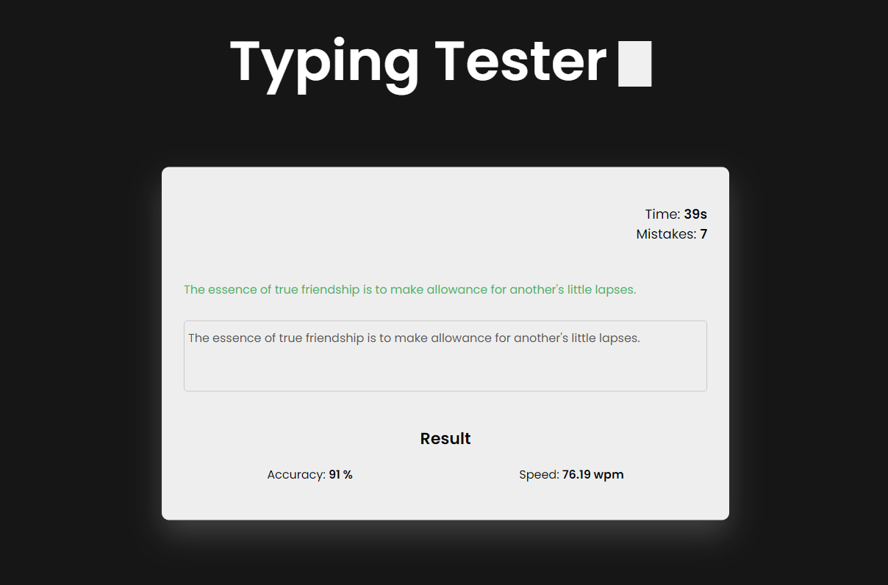

# Typing Tester

## Description:
Typing Tester is a web application that allows users to test their typing speed and accuracy. Users are presented with a random quote, and they need to type it as accurately and quickly as possible within a specified time limit. After the test, users receive feedback on their typing speed (words per minute) and accuracy.

## Features:
1. Random Quote Generation: The application fetches random quotes from the quotable.io API to provide users with diverse content for typing tests.
2. Typing Interface: Users can type the displayed quote in a text area.
3. Real-time Feedback: As users type, the application provides real-time feedback on typing accuracy by highlighting correct and incorrect characters.
4. Timer: The application includes a timer to limit the duration of the typing test.
5. Results Display: After completing the test or when time runs out, users receive feedback on their typing speed (words per minute) and accuracy.
6. Mistake Tracking: The application tracks and displays the number of mistakes made by the user during the typing test.

## Technologies Used:
- HTML and CSS: Used for structuring and styling the web page and making it visually appealing.
- JavaScript: Used for implementing dynamic behavior, such as fetching quotes, handling user input, and calculating typing speed and accuracy.
- Quotable.io API: Used to fetch random quotes for typing tests.

## How to Use:
1. Open the Typing Tester web application in a web browser.
2. Click on the "Start Test" button to begin the typing test.
3. Type the displayed quote in the text area as accurately and quickly as possible.
4. Once finished, click on the "Stop Test" button to end the test.
5. View the results, including typing speed (words per minute) and accuracy.

**Additional Information:**
- Project Status: [Active](https://arindal1.github.io/typing-tester-webapp/)
- License: [MIT License](LICENSE)

**Future Enhancements:**
- Add support for custom time limits.
- Implement user authentication and user profiles.
- Provide more detailed feedback and analysis of typing performance.
- Allow users to choose from different difficulty levels or categories of quotes.
- Improve the responsiveness and accessibility of the web application.

**Screenshots:**  

**Demo:** [link](https://arindal1.github.io/typing-tester-webapp/)

## Contact

If you have any questions, suggestions, or just want to connect, feel free to reach out:

- GitHub: [arindal1](https://github.com/arindal1)
- LinkedIn: [arindalchar](https://www.linkedin.com/in/arindalchar/)
- Twitter: [arindal_17](https://twitter.com/arindal_17)

## Keep Coding 🚀
